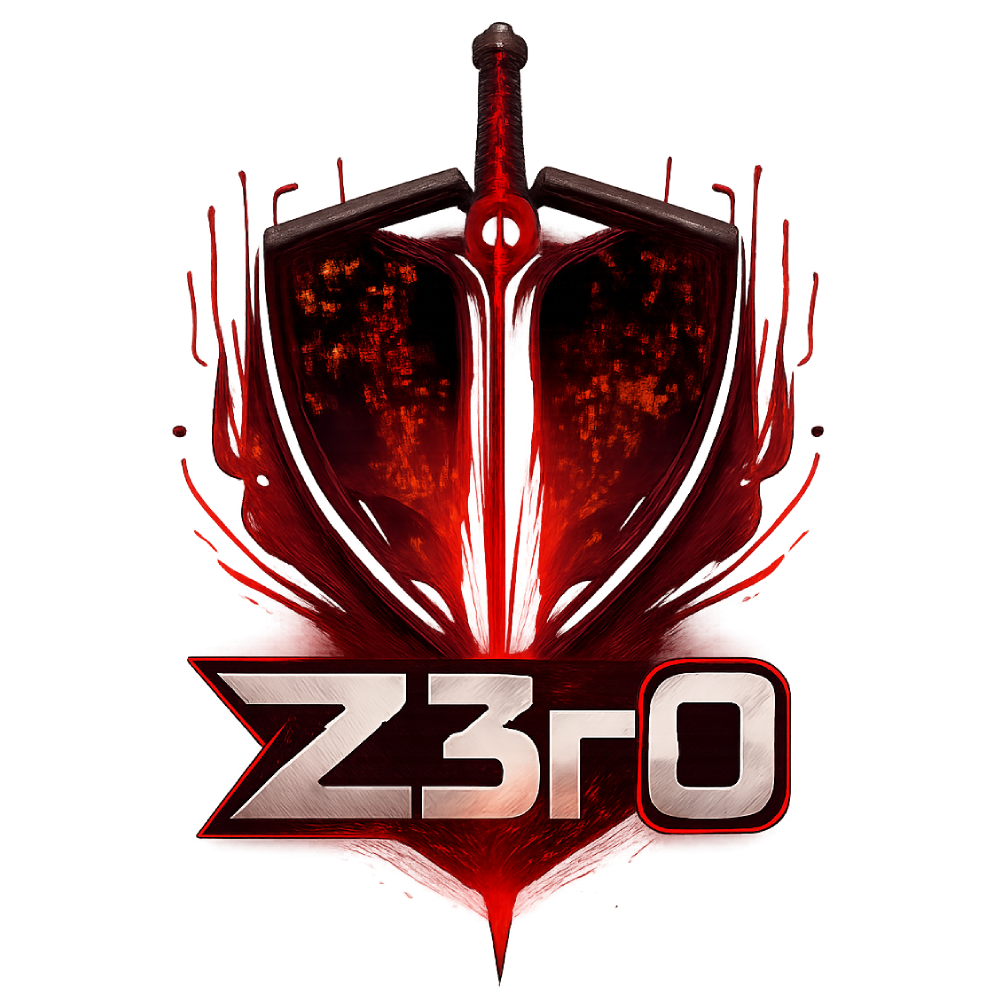
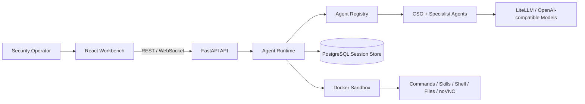
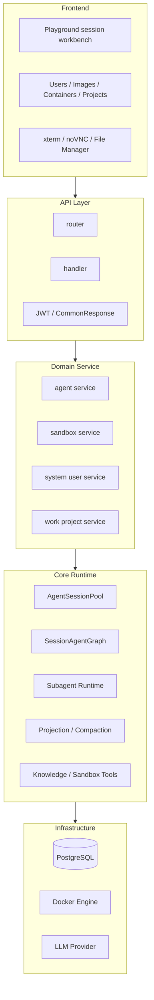
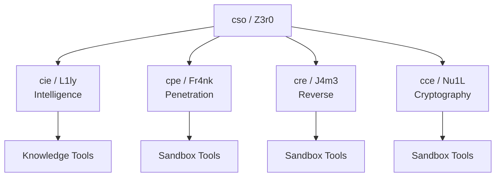
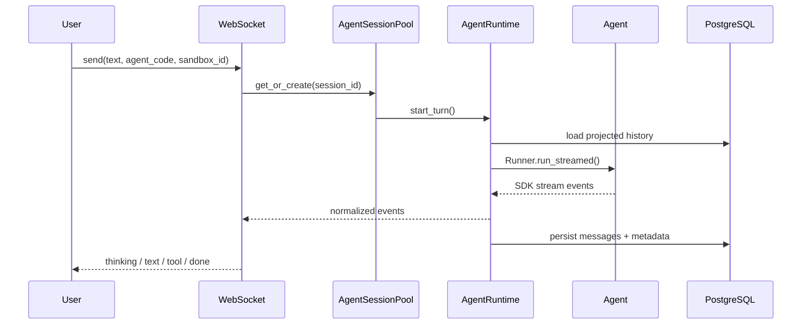
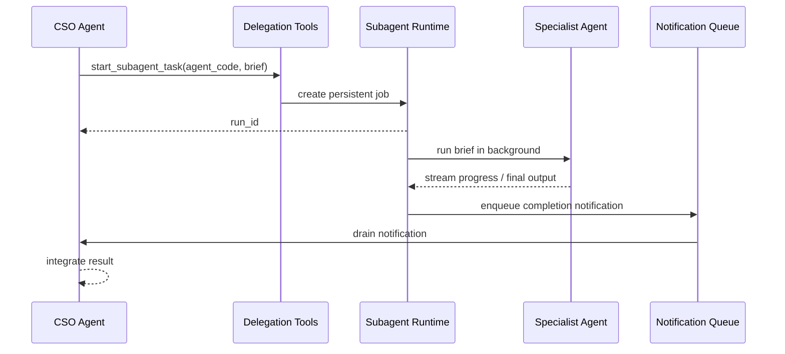
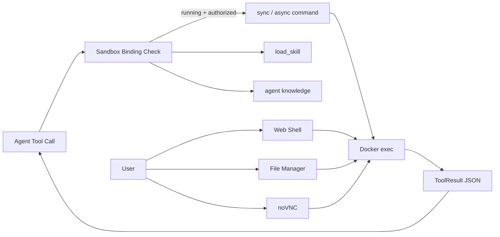

<p align="center">
  
</p>

<h1 align="center">Z3r0</h1>

<p align="center">
  A multi-agent collaboration platform for authorized red team operations, code auditing, and security research
</p>

<p align="center">
  <strong>English</strong> ·
  <a href="README_zh.md">中文</a>
</p>

<p align="center">
  <a href="#architecture">Architecture</a> ·
  <a href="#agent-team">Agent Team</a> ·
  <a href="#technical-highlights">Technical Highlights</a> ·
  <a href="#quick-start">Quick Start</a>
</p>

---

Z3r0 is a multi-agent collaboration platform for authorized red team operations, code auditing, and security research. It organizes security work around a coordinator, specialist agents, and controlled Docker sandboxes so analysis, validation, execution, and review can stay in one workflow.

## Design Context

Security work often spans multiple domains:

- Intelligence work starts with target profiling and asset mapping.
- Penetration testing needs interaction with live environments.
- Reverse engineering depends on toolchains and sample context.
- Cryptography review requires a separate analysis framework.

Z3r0 maps these responsibilities to specialized agents. `Z3r0` handles task understanding, decomposition, and result integration, while specialist agents work within their own domains. The platform provides a real-time workbench, persistent sessions, sandbox execution, and replayable history for long-running investigations.

## Architecture



The backend is organized around clear runtime boundaries: session lifecycle, agent graph construction, tool mounting, sandbox binding, stream-event normalization, and context compaction. The frontend consumes a stable application event protocol and does not depend on model SDK internals.

## Layered Design



## Agent Team

| Code | Name | Role | Responsibility |
| --- | --- | --- | --- |
| `cso` | Z3r0 | Chief Security Officer | Task decomposition, coordination, result integration |
| `cie` | L1ly | Chief Intelligence Engineer | Intelligence collection, asset mapping, relationship analysis |
| `cpe` | Fr4nk | Chief Penetration Engineer | Penetration testing, vulnerability validation, risk verification |
| `cre` | J4m3 | Chief Reverse Engineer | File, binary, firmware, and APK reverse engineering |
| `cce` | Nu1L | Chief Cryptography Engineer | Protocol review, key management, cryptographic implementation analysis |



Agent capabilities are built per session. `AgentRegistry` uses configuration, role specs, knowledge generation, and the current sandbox binding to create a session-level Agent Graph. Command tools are mounted only when a usable sandbox is bound to the session.

## Session Runtime Flow



Key design points:

- **Event normalization**: raw OpenAI Agents SDK stream events are converted into stable frontend events such as `thinking_delta`, `text_delta`, `tool_call`, `tool_result`, and `subagent_task`.
- **Session pool**: `AgentSessionPool` manages active sessions, interruption, cancellation, idle eviction, and tool-binding invalidation.
- **History projection**: `Z3r0Session` adds owner and nested-call metadata around SDK messages so each agent receives the right view of the shared conversation.
- **Automatic compaction**: when context approaches the model window, the runtime summarizes earlier projected history while keeping recent context and durable facts.

## Subagent Delegation Flow



Subagents run as persistent background jobs. Status, progress, results, and errors are stored in PostgreSQL and streamed to the frontend. Once a subagent reaches a terminal state, the parent agent receives a runtime notification and continues integrating the result.

## Sandbox Tooling Architecture



The optional sandbox image includes a browser, noVNC, Ghidra, jadx, sqlmap, nmap, and related tooling. Agents receive structured tool results, while operators can open an interactive shell, GUI screen, and file manager for manual takeover and review.

## Technical Highlights

- **Session-level Agent Graph**: role configuration, tools, knowledge, and subagents are bound dynamically per session.
- **Persistent delegation jobs**: subagents run in the background, can be canceled, can recover from stale runtime state, and notify the parent agent when finished.
- **Viewer-specific context projection**: agents share one persisted history while receiving scoped context views, reducing cross-agent leakage of private tool details.
- **Long-context compaction**: model-window-aware summaries preserve durable facts and recent state for long investigations.
- **Stable streaming contract**: the frontend is decoupled from SDK event details and consumes application-level event schemas.
- **Sandbox tool invalidation**: sandbox status changes invalidate tool bindings and clean up running subagent tasks or async commands.

## Repository Layout

```text
core/        Agent specs, runtime, delegation, context, tools
service/     Domain services: agent, sandbox, users, work projects
router/      FastAPI route declarations
handler/     HTTP and WebSocket handlers
model/       SQLModel database models
schema/      Pydantic API contracts
web/         React workbench
sandbox/     Optional Docker sandbox image
.z3r0/       Runtime config, agent prompts, logs
```

## Quick Start

```bash
cp .z3r0/config.json.example .z3r0/config.json
# Edit .z3r0/config.json for database, bootstrap admin, and model settings.
docker compose -f docker-compose.prod.yml up -d --build
```

Open `http://127.0.0.1:8000`.

## Security Boundary

Z3r0 is intended for authorized security testing, code auditing, red team exercises, and research or training environments. Sandbox containers, the Docker socket, terminal access, file management, and model credentials should be treated as high-privilege assets and used only in trusted, isolated environments.

## License

This repository does not currently declare an open source license. Add a `LICENSE` file before public release.
