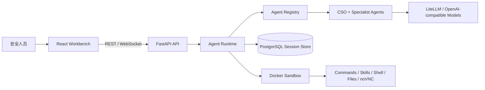
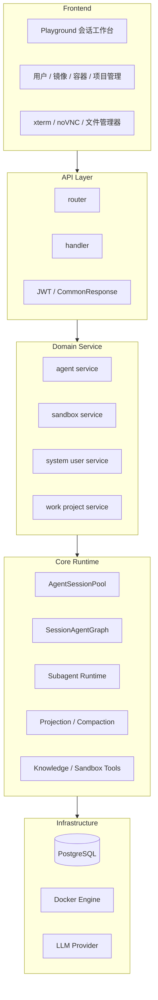
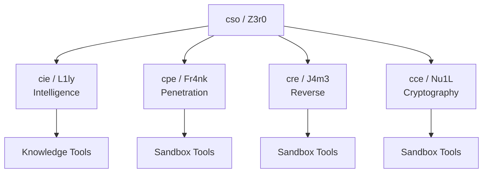
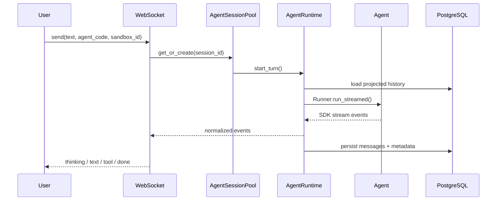
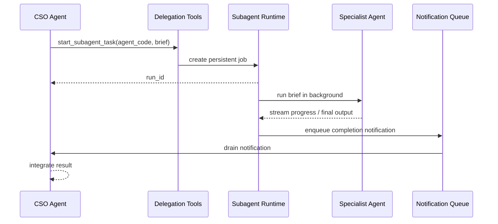
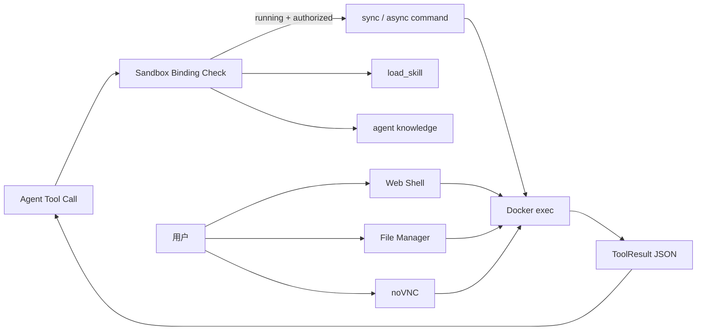

<p align="center">
  
</p>

<h1 align="center">Z3r0</h1>

<p align="center">
  面向授权红队、代码审计和安全研究场景的多 Agent 协作平台
</p>

<p align="center">
  <a href="README.md">English</a> ·
  <strong>中文</strong>
</p>

<p align="center">
  <a href="#总体架构">总体架构</a> ·
  <a href="#agent-编队">Agent 编队</a> ·
  <a href="#技术亮点">技术亮点</a> ·
  <a href="#快速运行">快速运行</a>
</p>

---

Z3r0 是一个面向授权红队、代码审计和安全研究场景的多 Agent 协作平台。它以“指挥官 + 专业工程师 + 可控沙箱”的方式组织安全任务，让分析、验证、执行和复盘都能在同一套工作流中完成。

## 设计背景

安全任务经常横跨多个专业方向：

- 情报收集需要先建立目标画像。
- 渗透验证需要真实环境交互。
- 逆向分析依赖工具链和样本上下文。
- 密码学问题需要独立的判断框架。

Z3r0 把这些职责拆给不同 Agent：`Z3r0` 负责目标理解、任务拆分和结论整合，专业 Agent 在各自边界内完成分析与验证。平台提供实时工作台、持久化会话、沙箱执行和历史回放，使长任务能够持续推进并保留可审计过程。

## 总体架构



后端围绕几个清晰边界组织：会话生命周期、Agent 图构建、工具挂载、沙箱绑定、事件流归一化和上下文压缩。前端不直接感知模型 SDK 细节，只消费统一事件协议并渲染工作台视图。

## 分层设计



## Agent 编队

| Code | Name | Role | 主要职责 |
| --- | --- | --- | --- |
| `cso` | Z3r0 | Chief Security Officer | 任务拆解、团队协调、结果整合 |
| `cie` | L1ly | Chief Intelligence Engineer | 情报收集、资产梳理、关系分析 |
| `cpe` | Fr4nk | Chief Penetration Engineer | 渗透测试、漏洞验证、风险确认 |
| `cre` | J4m3 | Chief Reverse Engineer | 文件、二进制、固件、APK 逆向 |
| `cce` | Nu1L | Chief Cryptography Engineer | 密码协议、密钥管理、实现审查 |



Agent 能力按会话动态生成。`AgentRegistry` 根据配置、角色规格、知识库版本和当前沙箱绑定生成会话级 Agent Graph；如果会话没有可用沙箱，命令类工具不会挂载，避免模型调用不可用能力。

## 会话运行链路



关键设计点：

- **事件归一化**：OpenAI Agents SDK 的原始流被转换成稳定的 `thinking_delta`、`text_delta`、`tool_call`、`tool_result`、`subagent_task` 等前端协议。
- **会话池**：`AgentSessionPool` 维护运行中会话，支持中断、取消、空闲回收和工具绑定失效。
- **历史投影**：`Z3r0Session` 在 SDK 原始消息外增加 owner、nested call 等元数据，使不同 Agent 能看到适合自己的上下文视图。
- **自动压缩**：当上下文接近模型窗口时，系统按会话与 Agent 视角生成摘要，保留近期上下文和关键事实。

## 子 Agent 委派链路



子 Agent 以持久化后台任务运行。任务状态、进度、结果和错误会写入数据库并实时推送到前端；主 Agent 收到完成通知后继续整合结果，适合长时间、多阶段安全分析。

## 沙箱工具架构



内置沙箱镜像包含浏览器、noVNC、Ghidra、jadx、sqlmap、nmap 等工具。Agent 侧接收结构化工具结果，用户侧可直接打开终端、图形界面和文件管理器，便于人工接管与复核。

## 技术亮点

- **会话级 Agent Graph**：同一套角色配置按会话状态动态绑定工具、知识库和子 Agent。
- **持久化委派任务**：子 Agent 后台运行、可取消、可恢复，并通过通知驱动主 Agent 继续推理。
- **多视角上下文投影**：共享数据库历史，但不同 Agent 只看到对自己合适的上下文，避免工具私有信息互相污染。
- **长上下文压缩**：基于模型窗口和消息投影自动生成摘要，降低长任务丢上下文的风险。
- **统一流式协议**：前端与模型 SDK 解耦，只消费稳定的应用事件模型。
- **沙箱工具热插拔**：沙箱状态变化会触发工具绑定失效，运行中任务和异步命令会被清理。

## 代码结构

```text
core/        Agent 规格、运行时、委派、上下文、工具
service/     业务服务：Agent、沙箱、用户、工作项目
router/      FastAPI 路由定义
handler/     HTTP/WebSocket 请求处理
model/       SQLModel 数据模型
schema/      Pydantic API 契约
web/         React 前端工作台
sandbox/     可选 Docker 沙箱镜像
.z3r0/       运行配置、Agent 角色提示词、日志
```

## 快速运行

```bash
cp .z3r0/config.json.example .z3r0/config.json
# 修改 .z3r0/config.json 中的数据库、管理员密码和模型配置
docker compose -f docker-compose.prod.yml up -d --build
```

访问 `http://127.0.0.1:8000`。

## 安全边界

Z3r0 面向合法授权的安全测试、代码审计、红队演练和研究教学场景。沙箱容器、Docker socket、终端、文件管理器和模型密钥都属于高权限资产，请只在可信隔离环境中使用。

## License

当前仓库尚未声明开源许可证。发布前建议补充 `LICENSE` 文件。
